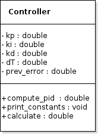

# ENPM808x TD5 Assignment

## Overview

Simple starter C++ project with:

- cmake
- googletest

## Standard install via command-line
```
git clone --recursive https://github.com/yashveer-umd/ENPM808x_TD5_pairYV.git
cd <path to repository>/ENPM808x_TD5_pairYV
mkdir build
cd build
cmake ..
make
Run tests: ./test/cpp-test
Run program: ./app/shell-app
```

## Building for code coverage (for assignments beginning in Week 4)
```
sudo apt-get install lcov
cmake -D COVERAGE=ON -D CMAKE_BUILD_TYPE=Debug ../
make
make code_coverage
```
This generates a index.html page in the build/coverage sub-directory that can be viewed locally in a web browser.

## Implementation
## Design
### CLASS DIAGRAM

### ACTIVITY DIAGRAM


## TODO
* After the Implementation edit kp, ki, and kd values in test.cpp TEST function line 14.
* Implement compute_method, and calculate_method for Controller Class in [file](app/libs/PID.cpp)
* Tune and set your own PID Gains when intializing Controller Class.
* Add some tests to ensure that negative gain values are not permitted.
* Add tests to check over a range of different gain values.
## Notes
* Be aware of whitespaces in code, as they can flag type 5 and above errors in the cpp-lint check.
* Follow a consistent style and common conventions while coding.
* Avoid using .hpp files and use .cpp and .h files seperately instead.
* Run the following command to format in the google coding style
```
cd app
clang-format -style=Google -i app/main.cpp

```


## Authors
### Part 1
* Yashveer Jain (Driver)
* Vignesh Ravichandran Radhakrishnan (Navigator)

## Part 2
* Tanmay Haldankar (Driver)
* Qamar Syed (Navigator)
